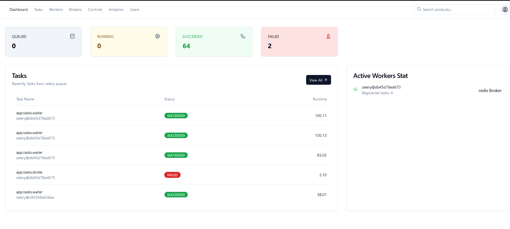
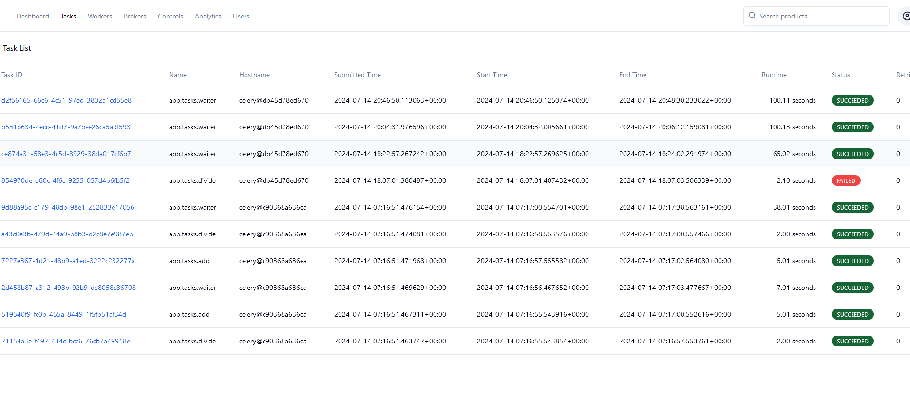
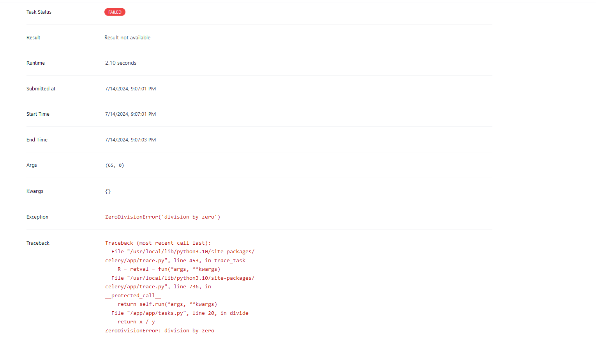

# Orchid

Orchid is a advanced Celery monitoring and management tool with modern UI and customizable features.

THIS PROJECT IS ACTIVELY IN DEVELOPMENT. DON'T USE IT IN PRODUCTION.

## Features

- Full Plan can be found [here](./backend/plan.md)

### Some Screenshots:

More information will be added soon.

## Contributing

Not open to contributions at the moment. But feel free to open an issue or a PR if you have any ideas or suggestions.

## License

MIT License - see the [LICENSE](./LICENSE) file for details